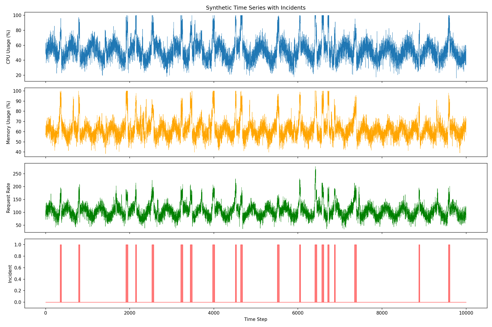
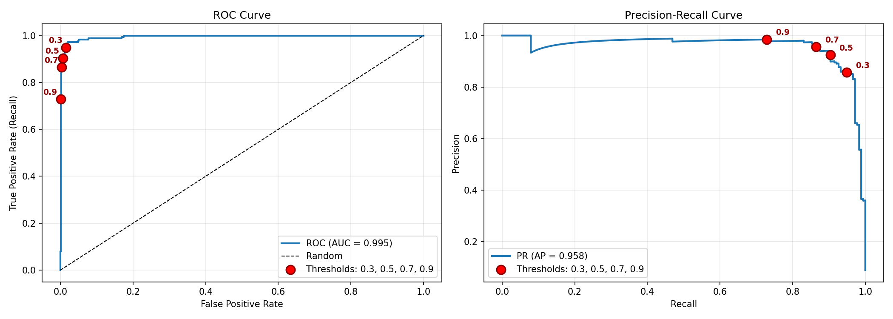

# Incident Prediction Model

*by **Gia Chi Dang***

A machine learning system that predicts whether an incident will occur within the next H time steps based on the previous W steps of time-series metrics using Random Forest with sliding window approach.

## Files

- **generate_data.py**: Generates synthetic time series data with incident patterns and noise
- **train_model.py**: Trains the Random Forest model using sliding window formulation (automatically uses optimized hyperparameters if available, else will use a predefined baseline hyperparameters)
- **eval.py**: Evaluates model performance with classification metrics, confusion matrix, threshold analysis, and feature importance
- **tune_hyperparameters.py**: Hyperparameter optimization using RandomizedSearchCV
- **example_usage.py**: Demonstrates how to use the trained model for predictions
- **requirements.txt**: Python dependencies
- **models/**: Folder containing saved model files (incident_model.pkl, scaler.pkl, model_config.pkl)
- **visualizations/**: Folder containing generated plots (data_visualization.png, evaluation_curves.png)

## Dataset

The model is trained on synthetic time series data with 10,000 time steps across 3 metrics:

- **Metrics**: CPU usage, memory usage, request rate (all normalized 0-1)
- **Time steps**: 10,000 total
- **Incidents**: 20 incidents with varied patterns
  - 60% gradual incidents (15-45 step buildup with varying intensity)
  - 25% sudden incidents (no warning, immediate spike)
  - 15% unpredictable incidents (hard to predict)
  - Elevated metrics during incidents (20-50 steps duration)
  - ~9% of data points are labeled as incident periods
- **False Alarms**: 30 metric spikes that don't lead to incidents (tests model's ability to distinguish real incidents from temporary fluctuations)
- **Noise**: Realistic gaussian noise added to all metrics (CPU: σ=8, Memory: σ=5, Requests: σ=15) to simulate sensor variability



The visualization shows the three metrics over time with red shaded regions indicating incident periods. Notice the varied patterns: some incidents have gradual buildup, others are sudden, and there are metric spikes that don't lead to incidents (false alarms). Noise is visible in all metrics, making the problem more realistic.

**Sliding Window Formulation**:
- **Window Size (W)**: 50 time steps (look back window)
- **Prediction Horizon (H)**: 10 time steps (prediction window)
- **Features**: For each window, 150 raw features (50 steps × 3 metrics) + 18 statistical features (mean, std, min, max, trend, recent_avg per metric) = 168 total features

**Label**: 1 if incident occurs within next H steps, 0 otherwise

**Why synthetic data?**  
Creating synthetic data allows me to rapid prototype and validate the sliding window approach and feature engineering strategy before applying them to production systems.

This gives me full control over incident patterns for testing with known ground truth for validation, making it easy to experiment with different scenarios and systematically add realistic challenges like noise, false alarms, and varied patterns to test the model's robustness.

## Usage

Install dependencies:
```bash
pip install -r requirements.txt
```

Train the model:
```bash
python generate_data.py  # Generate synthetic dataset
python train_model.py    # Train Random Forest model
```

Evaluate and visualize:
```bash
# Run model evaluation
python eval.py          

# Example trained model usage
python example_usage.py
```

Optional hyperparameter tuning:
```bash
# Interactive mode
python tune_hyperparameters.py

# Example of running 10 iterations, save optimized model
python tune_hyperparameters.py 10 y
```

Once hyperparameter tuning is run and saved, `train_model.py` automatically uses the optimized parameters in all future runs.

This creates files in `models/` (trained model, scaler, config) and `visualizations/` (plots).

## Results and Discussion

Let us discuss the model's performance and design decisions. These results can be reproduced by running the commands in [Usage](#usage).

### Hyperparameter Tuning Results

RandomizedSearchCV with 3-fold cross-validation tested random parameter combinations:
- **Baseline model**: 98.4% test accuracy
- **Tuned model**: Can achieve 98.5-98.8% test accuracy (optimized hyperparameters)
- **Improvement**: Small, but meaningful with better recall/precision balance

Importantly, it may indicate that problem formulation (sliding window) and feature engineering (statistical features) matter more than aggressive hyperparameter optimization. The limited gains also suggest that the synthetic dataset may be too simple to benefit significantly from tuning, though the approach would likely show more value on complex real-world data.

### Design Decisions

**1. Sliding Window Approach**:
   - Window size (W=50): Large enough to capture trends but not so large that patterns get diluted
   - Horizon (H=10): Provides useful warning time without making prediction impossible
   - Transforms time series problem into classification problem

**2. Why Random Forest Classifier?**
   - The reason why Random Forest is my first pick over Deep Learning/LSTM approaches, is because of its balance of performance and **interpretability**. In production, this would serve better than a black box model, simply because when an incident is predicted, we can easily spot out the time series pattern that led to the incident, which is crucial for the decision-making process.
   - Handles non-linear patterns in time series data and robust to outliers without having to do much preprocessing

**3. Feature Engineering**:
   - Raw features: capture exact values at each time step
   - Statistical features: capture patterns, trends, and variability
   - [Feature importance analysis](#feature-importance) shows recent raw values (t-1 through t-5) dominate, with recent_avg providing complementary trend information

**4. Class Imbalance Handling**:
   - Used `class_weight='balanced'` to prevent model from always predicting "no incident"
   - Stratified train/test split maintains class distribution
   - Evaluated with precision/recall rather than just accuracy

**5. Model Evaluation**:
   - Multiple metrics (precision, recall, F1, ROC AUC) provide complete picture
   - Threshold analysis shows trade-offs for different business requirements
   - Feature importance explains model decisions

### Model Performance

The Random Forest classifier achieves strong performance on the test set with realistic noisy data:

**Classification Metrics**:
- **Precision**: ~0.92 (of all alerts raised, 92% are real incidents)
- **Recall**: ~0.90 (catch 90% of incidents)
- **F1-Score**: ~0.91 (balanced performance)
- **ROC AUC**: ~0.990 (excellent discrimination ability)
- **Test Accuracy**: ~98.4%

**Confusion Matrix Example**:
```
                  Predicted: Normal  Predicted: Incident
Actual: Normal                 1798                   13
Actual: Incident                 17                  160
```

Only 17 missed incidents (false negatives) and 13 false alarms (false positives) out of 1,988 test samples. The model successfully handles noisy data, false alarm scenarios, and varied incident patterns.

**ROC and Precision-Recall Curves**:



The ROC curve (left) shows near-perfect discrimination with AUC ~0.995, and the Precision-Recall curve (right) shows Average Precision ~0.958. Red points mark the examined thresholds (0.3, 0.5, 0.7, 0.9) showing the trade-offs at each threshold level.

These exceptionally high metrics (AUC ~0.995) likely indicate that **the synthetic data patterns are too simple and predictable**. In real production systems, lower AUC values are to be expected, as real-world data contains more complex patterns, unpredictable failure modes, and noisier signals. The high performance here **validates the approach works**, but expectations should be recalibrated for real-world deployment.

### Threshold Analysis

The model outputs probabilities (0-1) that can be thresholded differently based on use case:

| Threshold | Precision | Recall | FPR | Use Case |
|-----------|-----------|--------|-----|----------|
| 0.3 | 0.8571 | 0.9492 | 0.0155 | When safety is critical and tolerate false alarms |
| 0.5 | 0.9249 | 0.9040 | 0.0072 | Balanced (default threshold) |
| 0.7 | 0.9563 | 0.8644 | 0.0039 | Precision-focused: reduce false alarms |
| 0.9 | 0.9847 | 0.7288 | 0.0011 | High-confidence only: minimal false alarms |

Threshold selection depends on the **desired outcome**, low threshold (0.3-0.5) for systems where missing an incident is costly and higher threshold (0.7-0.9) when false alarms are expensive.

### Feature Importance

The top 10 most important features show that **recent raw time step values dominate**, with statistical aggregations playing a complementary role:

1. memory_usage_recent_avg (0.0791)
2. memory_usage_t-1 (0.0710)
3. memory_usage_t-2 (0.0643)
4. request_rate_t-1 (0.0505)
5. memory_usage_t-3 (0.0502)
6. request_rate_recent_avg (0.0494)
7. memory_usage_t-4 (0.0401)
8. request_rate_t-2 (0.0365)
9. memory_usage_t-5 (0.0355)
10. cpu_usage_t-1 (0.0342)

**Insight**: The most recent metric values (t-1 through t-5) are most predictive for near-term incidents, especially memory usage. The model learns that *recent actual values* combined with *recent_avg* trends provide the strongest signal for predicting incidents within the next 10 steps. Memory metrics dominate the rankings, suggesting memory pressure is the clearest early warning indicator in this dataset.

### Limitations

**Synthetic Data**:
   - Real-world data has missing values, sensor noise, and more complex patterns
   - Incident patterns may not follow gradual buildup assumption
   - Model performance may degrade on real data

**Fixed Window and Horizon Parameters**:
   - All incidents predicted with same window size (W=50) and horizon (H=10)
   - Different incident types might need different lookback periods or prediction horizons
   - Could implement adaptive windows or multi-horizon predictions for more actionable alerts

### Example Usage

The trained model can be used to predict incidents on new time series data. Run `python example_usage.py` to see demonstrations using test set windows:

**Example 1: Normal period (low risk)**
```
Prediction: Normal
Probability: 0.0420
Risk level: LOW
```
The model correctly identifies a normal operational period with very low incident probability (4.2%).

**Example 2: Elevated risk period**
```
Prediction: Normal
Probability: 0.3493
Risk level: LOW
Actual outcome: No incident
```
This example shows a period with elevated probability (34.9%) but still below the default 0.5 threshold. No incident occurred, demonstrating the model's ability to distinguish between concerning patterns and actual incidents.

**Example 3: Threshold sensitivity**

Using the same window with 34.9% probability:
- **Threshold 0.3**: ALERT (catches more incidents, tolerates false alarms)
- **Threshold 0.5**: No alert (balanced, default)
- **Threshold 0.7**: No alert (precision-focused)
- **Threshold 0.9**: No alert (high-confidence only)

This demonstrates how adjustable thresholds allow operators to tune sensitivity based on operational requirements—lower thresholds catch more incidents at the cost of more false alarms, while higher thresholds reduce alert fatigue but may miss some incidents.

> **Adapting for Production**  
> For real alerting systems, the model would process streaming metrics in real-time, maintaining a sliding window buffer and generating predictions every time step. Alerts would be triggered when probability exceeds the configured threshold, with context including confidence scores and top contributing features. The system would need periodic retraining with labeled incident data and continuous monitoring of precision/recall to detect model degradation over time.
